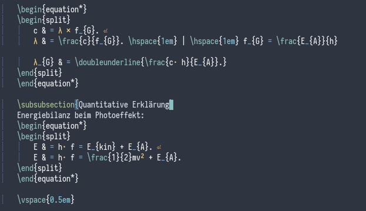

# forest-nord-vim

This is a fork of the official [Nord Theme](https://github.com/arcticicestudio/nord-vim).
I simply added more green to its syntax highlighting, thus forest-nord-vim.

To use this theme, add this to your .vimrc (assuming VimPlug):
```
	Plug 'cramermarius/forest-nord-vim', , { 'branch': 'develop' }
```
and then either add `color forest-nord` to your .vimrc or set it for the current session
by typing `:color forest-nord` in an active vim session.

---
Here is a screenshot of the slightly modified, more green nord:


---

Thank you to [Arctic Ice Studio](arcticicestudio.com) for making the most awesome theme
there is.
